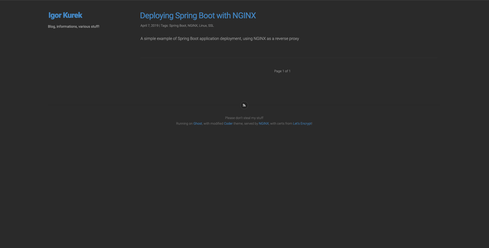
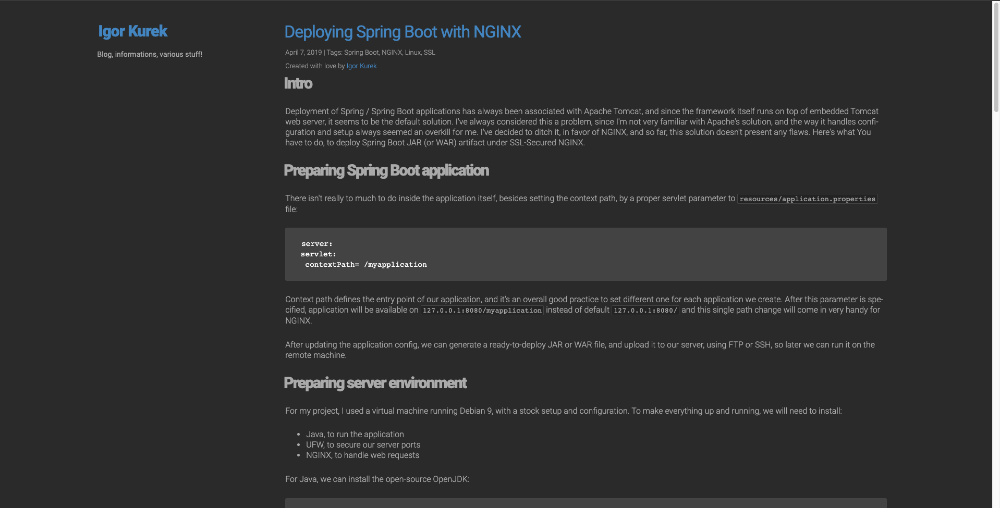

# Coderer Ghost Theme

## Origin
Coderer is based on original [Coder Theme](https://github.com/dongri/Coder "Coder"), altered to fit my needs and fix some issues, sincce the original is no longer maintained.

## Screenshots

## What's working and wht's not
Current version (2.0.1) is fully functional for any Ghost installation below version 3.0.0. I'm currently working for updating this project for latest Ghost release. So far, it's missing given classes:
* .kg-gallery-container
* .kg-gallery-row
* .kg-gallery-image
* .kg-bookmark-card
* .kg-bookmark-container
* .kg-bookmark-content
* .kg-bookmark-title
* .kg-bookmark-description
* .kg-bookmark-metadata
* .kg-bookmark-icon
* .kg-bookmark-author
* .kg-bookmark-publisher
* .kg-bookmark-thumbnail
Everything except `bookmarks` and `gallery` screens is fully themed.